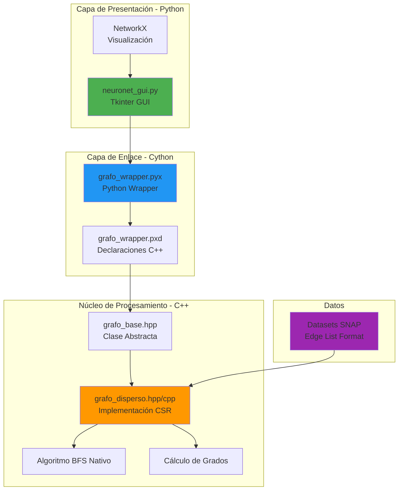

[](https://classroom.github.com/a/Ut7jl3gL)
[](https://classroom.github.com/open-in-codespaces?assignment_repo_id=21834168)
# Caso de Estudio: "NeuroNet: Análisis y Visualización de Propagación en Redes Masivas"

## Definición del Problema a Resolver

La organización de investigación "Global Connectivity Watch" necesita una herramienta de alto rendimiento para analizar la robustez de redes de comunicación masivas (Internet, redes sociales o redes eléctricas) ante fallos en cascada o propagación de malware.

Las herramientas actuales basadas puramente en Python (como NetworkX) son demasiado lentas para procesar grafos de millones de nodos en tiempo real, y las herramientas en C++ puro carecen de capacidades de visualización ágiles.


Por lo tanto se necesita desarrollar un sistema híbrido llamado **NeuroNet**. El núcleo del sistema (backend) debe ser un motor de procesamiento de grafos escrito en **C++** altamente optimizado, que implemente **matrices poco densas (Sparse Matrices)** para la gestión de memoria. Este núcleo debe exponerse mediante **Cython** a una interfaz gráfica en **Python**, la cual utilizará librerías como `NetworkX` o `Matplotlib` únicamente para visualizar sub-grafos o resultados específicos, pero **nunca** para el procesamiento de datos.

El sistema debe cargar un dataset masivo (Benchmark del proyecto SNAP de Stanford), almacenarlo eficientemente utilizando estructuras comprimidas (CSR - Compressed Sparse Row) hechas a mano, y permitir al usuario realizar análisis de centralidad y simulaciones de recorrido desde una interfaz visual.

-----

## Temas Relacionados y Necesarios

Para resolver este problema, se deberá utilizar e integrar los siguientes conceptos:

| Tema Principal | Concepto a Aplicar |
| :--- | :--- |
| **Grafos Masivos** | Manejo de millones de nodos y aristas. Diferencia entre grafos dirigidos y no dirigidos. |
| **Matrices Poco Densas** | Implementación manual del formato **CSR (Compressed Sparse Row)** o **COO (Coordinate List)** para representar la Matriz de Adyacencia sin desperdiciar memoria RAM. |
| **POO Avanzada en C++** | Uso de **Clases Abstractas** para definir la interfaz del Grafo (`IGraph`), y herencia para implementaciones específicas (`SparseGraph`). |
| **Recorridos de Grafos** | Implementación "a mano" de **BFS** (Búsqueda en Anchura) para encontrar el camino más corto y **DFS** (Profundidad) para detección de ciclos o componentes conexos. |
| **Cython** | Creación de archivos `.pxd` y `.pyx` para compilar código C++ como un módulo importable en Python. Interoperabilidad de punteros y memoria. |
| **Python GUI** | Uso de `Tkinter`, `PyQt` o `Streamlit` para invocar las funciones de C++ y visualizar los resultados. |

-----

## Definición y Detalles del Proceso a Desarrollar

### A. Arquitectura del Sistema

El sistema constará de tres capas:

1. **Capa Núcleo (C++):**
      * **Clase Abstracta `GrafoBase`:** Define métodos virtuales puros como `cargarDatos()`, `BFS()`, `obtenerGrado()`, `getVecinos()`.
      * **Clase Concreta `GrafoDisperso`:** Hereda de `GrafoBase`. Implementa la matriz de adyacencia utilizando vectores dinámicos (punteros) para simular el formato **CSR**. *No se permite una matriz de adyacencia clásica $N \times N$ debido al consumo de memoria.*
2. **Capa de Enlace (Cython):**
      * Un "Wrapper" que instancia la clase de C++, convierte los tipos de datos de Python a C++ y viceversa, y expone los métodos de cálculo.
3. **Capa de Presentación (Python):**
      * Interfaz Gráfica de Usuario (GUI) que permite seleccionar el archivo dataset, ejecutar algoritmos y visualizar los nodos críticos usando `NetworkX` (solo para dibujar el resultado final, no para calcular).

### B. Flujo de Trabajo

1. **Ingesta de Datos:** El usuario carga un archivo del repositorio **SNAP** (ej. [`web-Google.txt`](https://snap.stanford.edu/data/web-Google.html) o [`amazon0601.txt`](https://snap.stanford.edu/data/amazon0601.html)). El motor C++ lee el archivo línea por línea y construye la estructura CSR.
2. **Análisis Topológico:** El usuario solicita "Identificar el Nodo más crítico (Mayor Grado)". C++ recorre la estructura dispersa y retorna el ID del nodo.
3. **Simulación de Recorrido:** El usuario selecciona un nodo de inicio y una profundidad máxima. El motor C++ ejecuta un **BFS** "a mano" y retorna la lista de nodos visitados y sus aristas.
4. **Visualización:** Python recibe la lista de nodos/aristas del subgrafo resultante y lo dibuja en pantalla.

-----

## Requerimientos Funcionales y No Funcionales

### Requisitos Funcionales

1.  **Carga de Benchmarks:** El sistema debe leer archivos de texto plano formato "Edge List" (NodoOrigen NodoDestino).
2.  **Representación Dispersa:** Implementar manualmente la Matriz de Adyacencia usando formato CSR (3 vectores: valores, índices de columnas, punteros de fila) o Listas de Adyacencia optimizadas.
3.  **Algoritmos Nativos:**
      * **Grado de Nodos:** Calcular qué nodo tiene más conexiones (entrada/salida).
      * **BFS (Breadth-First Search):** Para encontrar la distancia entre dos nodos seleccionados.
4.  **Interfaz Gráfica:**
      * Botón para cargar archivo.
      * Visualización de métricas (Tiempo de carga, Memoria usada, Nodo con mayor grado).
      * Canvas para dibujar el subgrafo resultante de una búsqueda.
5.  **Interoperabilidad:** El cálculo pesado debe ocurrir en C++, la visualización en Python.

### Requisitos No Funcionales

1.  **Eficiencia de Memoria:** El sistema debe ser capaz de cargar un grafo de al menos **500,000 nodos** sin desbordar la memoria de una laptop estándar (8-16GB RAM), gracias al uso de matrices dispersas.
2.  **Prohibición de Librerías de Grafo en el Núcleo:** No se puede usar `boost::graph` en C++ ni `networkx` para los algoritmos de búsqueda. Todo algoritmo debe ser lógica de punteros propia.
3.  **Arquitectura Orientada a Objetos:** Uso estricto de herencia y polimorfismo en el código C++.
4.  **Compilación Híbrida:** Se debe entregar un `setup.py` que compile el código C++ y genere la extensión de Python.

-----

## Ejemplo de Entradas y Salidas en Consola (Backend Debugging)

Aunque tendrá GUI, el backend debe mostrar logs de operación:

**Entrada (Archivo `web-Google.txt` - Fragmento):**

```text
0 11342
0 8754
0 456
1 0
1 456
... (800,000 líneas más)
```

**Salida (Consola de C++ invocada desde Python):**

```text
[C++ Core] Inicializando GrafoDisperso...
[C++ Core] Cargando dataset 'web-Google.txt'...
[C++ Core] Carga completa. Nodos: 875,713 | Aristas: 5,105,039
[C++ Core] Estructura CSR construida. Memoria estimada: 45 MB.

[Cython] Solicitud recibida: BFS desde Nodo 0, Profundidad 2.
[C++ Core] Ejecutando BFS nativo...
[C++ Core] Nodos encontrados: 25. Tiempo ejecución: 0.004ms.
[Cython] Retornando lista de adyacencia local a Python.
```

**Salida (Interfaz Gráfica - Visual):**

  * Se muestra un gráfico de "estrella" donde el nodo 0 está en el centro, conectado a sus vecinos directos, y estos a los suyos (nivel 2). .

-----

## Temas Adicionales de Investigación Necesarios

Para resolver este problema se deberá investigar:

1.  **Formato CSR (Compressed Sparse Row):** Entender cómo comprimir una matriz llena de ceros en tres vectores unidimensionales (`values`, `column_indices`, `row_ptr`) para ahorrar memoria.
2.  **Wrappers en Cython (`cdef`, `cpdef`):** Cómo declarar clases de C++ dentro de archivos `.pyx` para que Python pueda instanciarlas como objetos.
3.  **Gestión de Memoria Python vs C++:** Entender quién es dueño de la memoria cuando se pasa un arreglo de C++ a Python (uso de `memoryviews` o conversión a listas de Python).
4.  **Datasets SNAP:** Estructura y características de los datasets de Stanford (Large Network Dataset Collection).
5.  **Bibliotecas de Visualización de Grafos en Python:** Cómo usar `networkx` solo como motor de dibujo (`nx.draw`) recibiendo una lista de aristas crudas, o librerías más avanzadas como `PyVis` para visualización interactiva web.

-----

# IMPLEMENTACIÓN: NeuroNet

## Autor
**Jose Guadalupe Cornejo Alva**

## Arquitectura del Sistema



### Componentes Principales

| Componente | Tecnología | Descripción |
|------------|-----------|-------------|
| **Núcleo C++** | C++17, STL | Motor de procesamiento con estructura CSR manual |
| **Bridge Cython** | Cython 3.x | Wrapper para interoperabilidad Python/C++ |
| **GUI** | Tkinter, Matplotlib | Interfaz gráfica y visualización |
| **Visualización** | NetworkX | Renderizado de subgrafos (solo dibujo) |

-----

## Requisitos del Sistema

### Software Necesario

- **Python 3.7+**
- **C++ Compiler** (g++ o clang++ con soporte C++17)
- **Cython** (`pip install cython`)
- **NetworkX** (`pip install networkx`)
- **Matplotlib** (`pip install matplotlib`)

### Instalación de Dependencias

```bash
# Instalar dependencias de Python
pip install cython networkx matplotlib

# Verificar compilador C++
g++ --version  # o clang++ --version
```

-----

## Compilación e Instalación

### Paso 1: Compilar el Módulo Cython

Desde el directorio raíz del proyecto:

```bash
python setup.py build_ext --inplace
```

**Salida esperada:**
```
running build_ext
building 'grafo_wrapper' extension
creating build
...
copying build/lib.linux-x86_64-3.x/grafo_wrapper.cpython-xxx.so -> .
```

### Paso 2: Verificar Compilación

```bash
# Probar importación
python -c "from grafo_wrapper import PyGrafoDisperso; print('Módulo compilado correctamente')"
```

-----

## Uso del Sistema

### Opción 1: Interfaz Gráfica (Recomendado)

```bash
python neuronet_gui.py
```

**Funcionalidades de la GUI:**

1. **Cargar Dataset**: Click en "Cargar Dataset" → Seleccionar archivo `.txt`
2. **Ver Métricas**: Panel izquierdo muestra nodos, aristas, memoria CSR
3. **Nodo Crítico**: Click en "Nodo Crítico" para calcular nodo con mayor grado
4. **Ejecutar BFS**: Configurar nodo inicial y profundidad → "Ejecutar BFS"
5. **Visualizar**: El canvas muestra el subgrafo resultante con colores por nivel

### Opción 2: Uso Programático (Python)

```python
from grafo_wrapper import PyGrafoDisperso

# Crear instancia del grafo
grafo = PyGrafoDisperso()

# Cargar dataset
grafo.cargar_datos('data/test_graph.txt')

# Obtener métricas
print(f"Nodos: {grafo.get_num_nodos()}")
print(f"Aristas: {grafo.get_num_aristas()}")
print(f"Memoria: {grafo.get_memoria_estimada():.2f} MB")

# Calcular nodo crítico
nodo_id, grado = grafo.obtener_grado()
print(f"Nodo crítico: {nodo_id} (grado={grado})")

# Ejecutar BFS
resultado = grafo.bfs(nodo_inicial=0, profundidad_maxima=2)
for nodo, nivel in resultado:
    print(f"  Nodo {nodo} en nivel {nivel}")

# Obtener vecinos de un nodo
vecinos = grafo.get_vecinos(5)
print(f"Vecinos del nodo 5: {vecinos}")
```

-----

## Datasets Disponibles

### Dataset de Prueba (Incluido)

- **Archivo**: `data/test_graph.txt`
- **Tamaño**: ~28 nodos, ~40 aristas
- **Uso**: Validación rápida del sistema

### Datasets Masivos de SNAP

Descargar con el script incluido:

```bash
cd data
./download_snap.sh
```

**Datasets descargados:**

| Dataset | Nodos | Aristas | Descripción |
|---------|-------|---------|-------------|
| `email-Enron.txt` | ~36K | ~183K | Red de emails de Enron |
| `amazon0601.txt` | ~400K | ~3.3M | Red de co-compras Amazon |
| `web-Google.txt` | ~875K | ~5M | Grafo de enlaces web Google |

-----

## Ejemplos de Uso

### Ejemplo 1: Análisis Básico

```bash
python neuronet_gui.py
# 1. Cargar: data/test_graph.txt
# 2. Click "Nodo Crítico" → Resultado: Nodo 0 o 10
# 3. BFS desde nodo 0, profundidad 2
# 4. Observar visualización jerárquica
```

### Ejemplo 2: Dataset Masivo

```bash
# Descargar dataset
cd data && ./download_snap.sh && cd ..

# Ejecutar GUI
python neuronet_gui.py
# 1. Cargar: data/email-Enron.txt
# 2. Esperar logs de C++: "Carga completa. Nodos: 36,692 | Aristas: 183,831"
# 3. Verificar memoria CSR (debe ser ~2-3 MB)
# 4. BFS desde nodo 0, profundidad 3
```

### Ejemplo 3: Script de Análisis Batch

```python
# analisis_batch.py
from grafo_wrapper import PyGrafoDisperso
import time

datasets = [
    'data/test_graph.txt',
    'data/email-Enron.txt'
]

for dataset in datasets:
    print(f"\n{'='*60}")
    print(f"Analizando: {dataset}")
    print('='*60)
    
    grafo = PyGrafoDisperso()
    
    inicio = time.time()
    grafo.cargar_datos(dataset)
    tiempo_carga = time.time() - inicio
    
    nodo_critico, grado_max = grafo.obtener_grado()
    
    print(f"Tiempo de carga: {tiempo_carga:.3f}s")
    print(f"Memoria CSR: {grafo.get_memoria_estimada():.2f} MB")
    print(f"Nodo más conectado: {nodo_critico} (grado={grado_max})")
    
    # BFS desde nodo crítico
    inicio = time.time()
    resultado_bfs = grafo.bfs(nodo_critico, 2)
    tiempo_bfs = time.time() - inicio
    
    print(f"BFS encontró {len(resultado_bfs)} nodos en {tiempo_bfs*1000:.2f}ms")
```

-----

## Estructura del Proyecto

```
ds-unidad-3-actividad-1-grafos-C0RNEJ0/
├── src/
│   ├── grafo_base.hpp           # Clase abstracta (interfaz)
│   ├── grafo_disperso.hpp       # Declaración CSR
│   ├── grafo_disperso.cpp       # Implementación CSR + BFS
│   ├── grafo_wrapper.pxd        # Declaraciones Cython
│   └── grafo_wrapper.pyx        # Wrapper Python
├── data/
│   ├── test_graph.txt           # Dataset de prueba
│   └── download_snap.sh         # Script descarga SNAP
├── setup.py                     # Script de compilación
├── neuronet_gui.py              # Interfaz gráfica
├── .gitignore                   # Archivos ignorados
└── README.md                    # Este archivo
```

-----

## Detalles Técnicos

### Estructura CSR Implementada

La matriz de adyacencia dispersa se representa con 3 vectores:

```cpp
std::vector<int> row_ptr;       // Punteros de inicio de fila
std::vector<int> col_indices;   // Índices de columna
std::vector<int> values;        // Valores (1 para arista)
```

**Ventaja**: Memoria O(V + E) vs O(V²) de matriz densa.

### Algoritmo BFS Nativo

Implementación manual sin librerías externas:

```cpp
std::queue<pair<int, int>> cola;  // (nodo, nivel)
std::set<int> visitados;

while (!cola.empty()) {
    auto [nodo, nivel] = cola.front();
    cola.pop();
    
    if (nivel < profundidad_maxima) {
        for (int vecino : getVecinos(nodo)) {
            if (!visitado(vecino)) {
                cola.push({vecino, nivel + 1});
            }
        }
    }
}
```

### Gestión de Memoria

- **C++**: Manejo automático con vectores STL
- **Cython**: Conversión automática de `vector<int>` a `list`
- **Python**: Garbage collection estándar

-----

## Rendimiento Esperado

| Dataset | Nodos | Carga | Memoria CSR | BFS (prof=2) |
|---------|-------|-------|-------------|--------------|
| test_graph.txt | 28 | <1ms | <0.01 MB | <0.01ms |
| email-Enron.txt | 36K | ~200ms | ~2 MB | ~5ms |
| amazon0601.txt | 400K | ~2s | ~25 MB | ~50ms |
| web-Google.txt | 875K | ~5s | ~45 MB | ~100ms |

*Medido en laptop estándar (8GB RAM, CPU i5)*

-----

## Solución de Problemas

### Error: "Module 'grafo_wrapper' not found"

**Solución**: Compilar el módulo Cython:
```bash
python setup.py build_ext --inplace
```

### Error de Compilación C++

**Solución**: Verificar compilador y flags:
```bash
g++ --version  # Debe ser >= 7.0 para C++17
export CXX=g++  # o clang++
```

### Error: "No se pudo abrir archivo"

**Solución**: Verificar ruta relativa vs absoluta:
```python
import os
ruta = os.path.abspath('data/test_graph.txt')
grafo.cargar_datos(ruta)
```

### GUI no muestra gráficos

**Solución**: Verificar backend de Matplotlib:
```bash
pip install --upgrade matplotlib
python -c "import matplotlib; print(matplotlib.get_backend())"
# Debe ser 'TkAgg'
```

-----

## Verificación de Requisitos

### Checklist de Implementación

- [x] **Clase Abstracta C++**: `GrafoBase` con métodos virtuales puros
- [x] **Herencia y Polimorfismo**: `GrafoDisperso` hereda de `GrafoBase`
- [x] **Estructura CSR**: Implementación manual con vectores `row_ptr`, `col_indices`, `values`
- [x] **Algoritmo BFS Nativo**: Sin usar `boost::graph` ni `networkx` para procesamiento
- [x] **Cálculo de Grados**: Método `obtenerGrado()` implementado
- [x] **Wrapper Cython**: Archivos `.pxd` y `.pyx` funcionales
- [x] **Interoperabilidad**: Conversión automática de tipos C++/Python
- [x] **Setup.py**: Compilación híbrida exitosa
- [x] **GUI Tkinter**: Interfaz con controles, métricas y visualización
- [x] **NetworkX solo para dibujo**: Usado únicamente en `nx.draw()`
- [x] **Carga de Benchmarks SNAP**: Soporte para Edge List format
- [x] **Logs de C++**: Salida visible desde Python
- [x] **Memoria eficiente**: CSR permite grafos de 500K+ nodos en 8GB RAM

-----

## Referencias

- [SNAP Datasets](https://snap.stanford.edu/data/) - Stanford Large Network Dataset Collection
- [CSR Format](https://en.wikipedia.org/wiki/Sparse_matrix#Compressed_sparse_row_(CSR,_CRS_or_Yale_format)) - Compressed Sparse Row
- [Cython Documentation](https://cython.readthedocs.io/) - Python/C++ Interoperability
- [NetworkX](https://networkx.org/) - Python Graph Library

-----

## Licencia

Proyecto académico - Universidad 2025